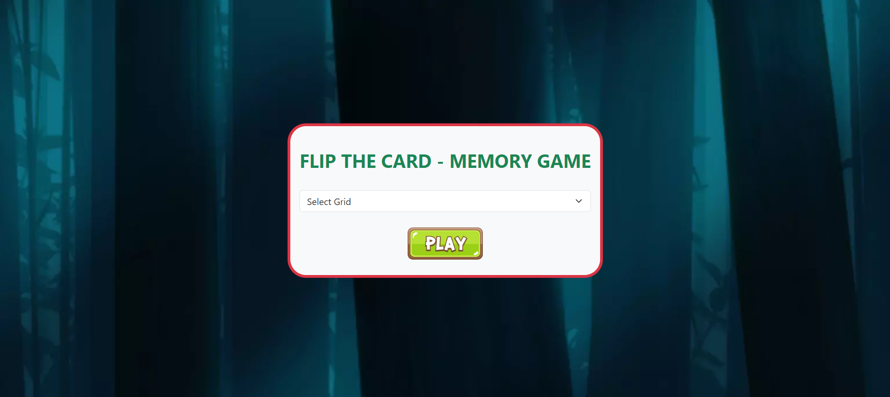
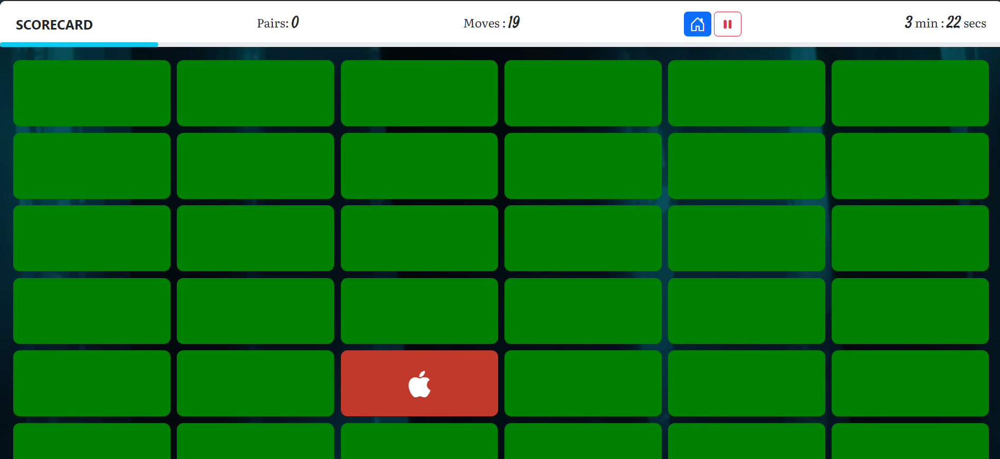
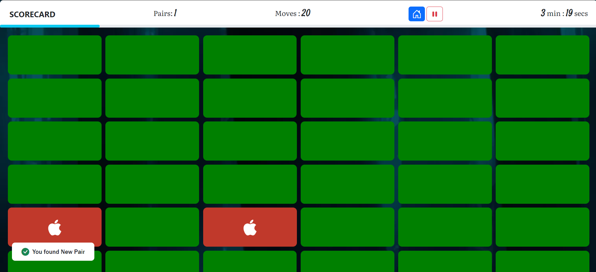
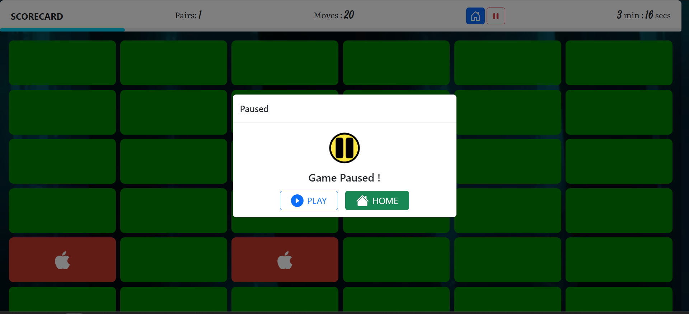

# Flip Card Memory Game

Flip Card Memory Game purely created using HTML, CSS, Javascript & jQuery. Icons Used in these projects are taken from Bootstrap Icons. Image are also obtained and downloaded which were publicly available.
These game is created as a project/Assignment of jQuery in **Systenics Solutions**.

## Screenshots:
1. Start Page of the Game

2. Game Page of the Game`

3. Pair Found or Match Found in the Game

4. Game Pause Page.

## Author: Prathamesh Dhande
